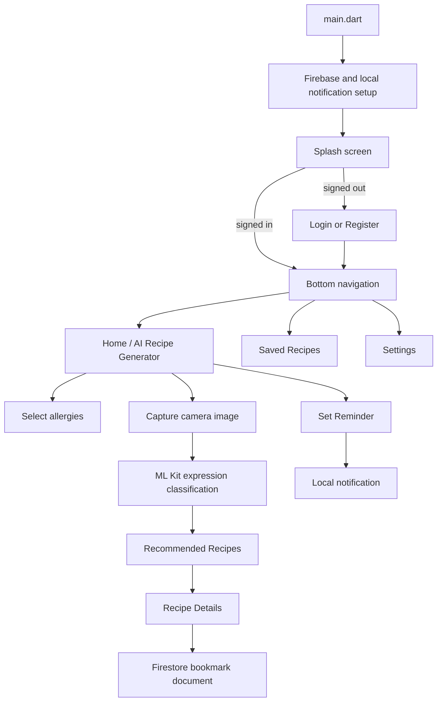

# Mood Eats

Mood Eats is a Flutter mobile application that recommends recipes after classifying a user's facial expression. The app captures an image with the device camera, uses Google ML Kit face detection to assign a simple expression label, and reads recipe documents from Cloud Firestore. Users can also record allergies, bookmark recipes, view their account details, and schedule local meal reminders.

The current implementation is a Firebase-backed recipe browser with camera-assisted expression classification. It does not call a generative AI or recipe-generation API; recipes must already exist in Firestore.

## Features

- Email/password registration and login with Firebase Authentication.
- A Firestore `users/{uid}` document containing the user's name and email.
- Camera capture through `image_picker`.
- Facial-expression heuristics through Google ML Kit:
  - smiling probability above `0.7` → `happy`
  - smiling probability below `0.2` → `sad`
  - both eyes below `0.3` → `cry`
  - both eyes above `0.7` → `angry`
- Allergy selection for Milk, Egg, Fish, and Wheat using a Provider model.
- A Firestore recipe stream with a randomized list of up to five recipes.
- Recipe detail pages with separate Ingredients and Instructions tabs.
- Bookmarking of recommended recipes and a saved-recipes tab.
- Date/time selection and scheduled local notifications for meal reminders.
- Settings page showing the signed-in user's name and email, with logout.
- Shared Flutter widgets, color constants, image constants, and form validation helpers.

## App flow



The expression label is used in the recommendation screen title. The current Firestore query filters recipes by the `category` field when allergies are selected; it does not filter by the stored `mood` field.

## Tech stack

| Area | Implementation |
| --- | --- |
| UI | Flutter / Dart, Material 3 styling |
| State | `provider ^6.1.2` |
| Authentication | `firebase_auth ^4.7.2`, `firebase_core ^2.27.0` |
| Database | `cloud_firestore ^4.8.4` |
| Face analysis | `google_mlkit_face_detection ^0.11.0` |
| Camera | `image_picker ^0.8.6+5` |
| Notifications | `flutter_local_notifications ^13.0.0`, `timezone ^0.9.2` |
| Navigation and pickers | `page_transition ^2.0.9`, `bottom_picker ^2.3.3` |
| Utilities | `uuid ^4.4.0`, shared widgets, and validation helpers |

The package also declares `firebase_storage`, `device_preview`, and `flutter_launcher_icons`. `firebase_storage` is not referenced by the Dart source, and the `DevicePreview` wrapper is commented out in `main.dart`.

## Requirements

- Flutter with a Dart SDK satisfying `>=3.2.4 <4.0.0`.
- Android SDK with compile SDK 34.
- Android API 21 or later.
- A Firebase project with Authentication and Firestore enabled.
- A physical device or simulator/emulator suitable for the camera and face-detection flow.

The ML Kit camera path is intended for mobile; the generated desktop/web folders do not provide an equivalent fallback.

## Getting started

```bash
git clone https://github.com/safwanrashid4/Mood-Eats.git
cd Mood-Eats
flutter pub get
flutter run
```

The repository includes a generated `lib/firebase_options.dart`, `firebase.json`, and Android `google-services.json` for the Firebase project named `moodeatsai`. If you use that project, confirm that Email/Password sign-in and Cloud Firestore are enabled and that the recipe data described below has been seeded.

The Firebase client configuration is checked into the repository. These client identifiers are intended for app configuration, but they do not protect data by themselves; use Firebase Authentication and restrictive Firestore/Storage rules for any deployed project.

To use your own Firebase project:

```bash
flutterfire configure
flutter pub get
flutter run
```

For iOS camera builds, add an `NSCameraUsageDescription` entry to `ios/Runner/Info.plist`. The checked-in plist does not currently contain that entry. Also verify the Firebase setup for the iOS bundle identifier (`com.example.moodeatsai` in the generated options).

## Firestore data model

| Path | Fields used by the app |
| --- | --- |
| `users/{uid}` | `name`, `email` |
| `recipe/{recipeId}` | `name`, `time`, `ingredient`, `instruction`, `mood`, `category` |
| `save_recipe/{uid}` | `bookmarks`: array of recipe document IDs |

`RecipeDbservice.addRecipe` can write a recipe document with a generated UUID, but the in-app seed button is commented out. Recipe documents therefore need to be inserted through Firebase tooling or another trusted data-loading path.

When allergies are selected, the app applies a Firestore `whereNotIn` filter to `recipe.category`. Keep category values consistent with the allergy labels if this filter is intended to exclude allergen categories. Firestore security rules are not included in this repository and must be configured separately.

## Project structure

```text
Mood-Eats/
├── android/                 Android project and Firebase Gradle wiring
├── ios/                     iOS project
├── assets/
│   ├── icons/                book, facial, logo, pizza, and wave images
│   └── images/               Mood Eats logo
├── lib/
│   ├── constants/            Colors, image paths, and UI text
│   ├── db_services/          Auth, recipe, and notification services
│   ├── provider/             ChangeNotifier state models
│   ├── screens/              Auth, home, face, recipe, reminder, and settings screens
│   ├── utils/                Date/time helpers and callback typedefs
│   ├── widgets/              Reusable buttons and text fields
│   ├── firebase_options.dart Firebase platform options
│   └── main.dart              App entry point and Provider setup
├── test/                     Flutter widget test directory
├── firebase.json
├── pubspec.yaml
└── analysis_options.yaml
```

## Important implementation notes

- The app waits three seconds on the splash screen, then uses the current Firebase Auth user to choose between the bottom-navigation shell and the login screen.
- The default bottom-navigation index is changed to the home screen after the first frame.
- The face detector processes only the first detected face and can append more than one label; the UI displays the first label.
- Recommended recipes are randomized from the Firestore stream and limited to at most five entries.
- Ingredients are displayed by splitting the stored string on commas, and instructions by splitting on periods.
- Reminders are local device notifications. They are not persisted in Firestore and there is no edit/delete reminder flow.
- `Firebase.initializeApp` and notification initialization are invoked without awaiting their returned futures in `main.dart`.
- `firebase_options.dart` explicitly throws for Linux. Other desktop/web options exist, but the camera/ML Kit flow still needs platform-specific validation.
- The Android release build currently uses the debug signing configuration. Configure a release keystore before publishing.
- `test/widget_test.dart` is still the starter Flutter counter test and does not test Mood Eats behavior.
- No license file is included in the repository.

## License

No license file is included. Add a license before distributing the project or accepting external contributions.
